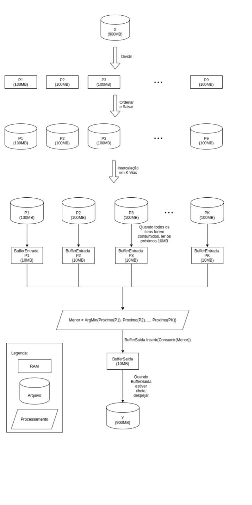

# TrabalhoAED2
Trabalho de BCC33A - ALGORITMOS E ESTRUTURAS DE DADOS 2.

Dupla: Igor e Getúlio

# Objetivos
O trabalho consiste em ordenar arquivos grandes sem utilizar mais de 100 megas da RAM.
## TAD Buffer Entrada
Operações necessárias:
- **Criar**: aloca o espaço para os N registros que vão ser lidos do arquivo de entrada.
- **Proximo**: retorna o proximo registro do buffer sem removê-lo. 
- **Consumir**: retorna o proximo registro do buffer e o remove. 
- **Vazio**: Retorna 1 ou 0, dependendo se todos os registros já foram consumidos pela função consumir.
- **Destruir**: fecha o arquivo e desaloca as variáveis.

## TAD Buffer Saida
Operações necessárias:
- **Criar**: aloca o espaço para os N registros e abre o arquivo de saída.
- **Inserir**: insere um registro no buffer de entrada. 
- **Despejar**: escreve N registros no arquivo de saída, mas somente se N <= quantidade de elementos inseridos.
- **Vazio**: Retorna 1 ou 0, dependendo se todos os registros já foram consumidos pela função consumir.
- **Destruir**: fecha o arquivo e desaloca as variáveis.

## Fluxo de dados
Com esses dois TADs será possivel seguir o seguinte fluxo de dados:

Para ordernar os primeiros arquivos utilizamos do algoritmo de ordenação _QuickSort_, e para intercalar em K-Vias utilizamos o _MergeSort_.
